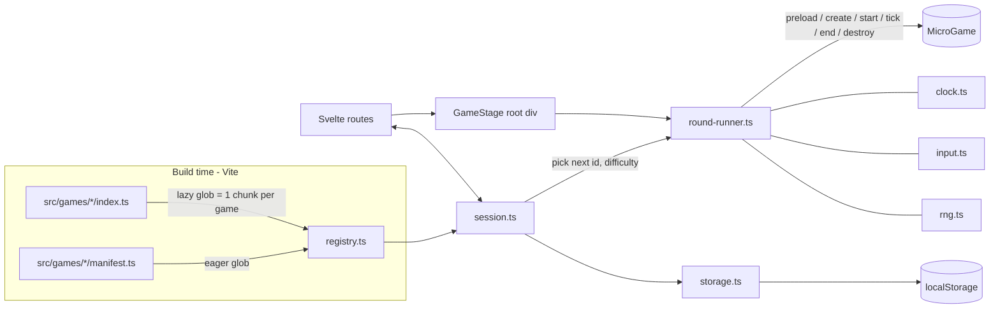
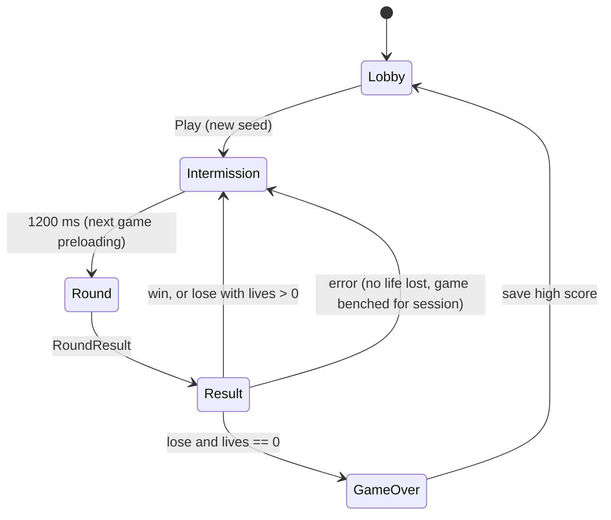

# Agentic Arcade — Implementation Plan

Status: proposed · Contract version: 1 · Owner: @CounterTorque

> **Implementation status:** M0 (scaffold, CI), M1 (contract, runtime, test harness, scripts, template), M2 (Jump and shell UI), M3 (session and persistence) and the M4 documentation are implemented. The M4 multi-agent pilot has not been run. This plan is kept as the original design; see [architecture.md](architecture.md) for the as-built system and its deviations from this document. Since then the manifest dropped `author` and gained a required `controlHint` (see game-contract.md).

`[VERIFY]` marks a third-party detail to confirm at implementation time. Each one says how to check it.

---

## 1. Executive summary

Agentic Arcade is a fully static web app in the style of WarioWare. A Svelte 5 shell chains short micro-games, each 2–8 seconds long, into an endless session with lives, rising speed, and a local high score. Every micro-game lives in its own directory, `src/games/<id>/`, and implements a small, versioned TypeScript contract exported from one public module, `@arcade/sdk`. The host discovers games at build time with Vite's `import.meta.glob`. Merging a new game directory to `main` is therefore the only step needed to ship it: no registry, list, route table, or config file is edited. The host owns the frame loop, input, timing, randomness, outcome resolution, and persistence. That makes games deterministic and testable, and it lets the framework run one generic contract-test suite against every game automatically. A GitHub Actions workflow lints, type-checks, contract-tests, budget-checks, builds, and deploys `main` to GitHub Pages. A PR-scope check makes sure a `game/<id>` branch only changes files under `src/games/<id>/`. The reference game, **Jump**, uses every part of the contract: preload, assets, input, rng, difficulty scaling, self-resolved loss, timeout win, the settle phase, and teardown.

## 2. Goals / Non-goals

**Goals**
- N agents can add N games at the same time with **zero shared-file edits** and no merge conflicts.
- A merged game appears on the deployed site automatically after the `main` deploy finishes.
- One explicit, versioned, type-checked host↔game contract, enforced by automated tests, lint rules, and scripts.
- Deterministic, headless-testable games: host-driven ticks, seeded RNG, and no wall-clock access.
- A fully static build on GitHub Pages under the `/agentic-arcade/` base path.
- A playable endless session (lives, speed-ups, high score), a practice mode for single games, and a gallery.
- An `AGENTS.md` complete enough that an agent can ship a game correctly on the first try.

**Non-goals (MVP)**
- Backend, accounts, leaderboards, analytics, telemetry.
- Multiplayer or networked play.
- Audio (the contract reserves room for it; see M5).
- Iframe or worker sandboxing of games. Isolation comes from convention and lint, not security boundaries.
- Per-PR deployed previews (GitHub Pages has none; artifacts replace them).
- Per-game npm dependencies.
- i18n, theming, gamepad support.
- Mobile and touch. Desktop browsers with keyboard and mouse only; no responsive or portrait layout.
- Enforced review rules beyond "PR required to merge to `main`". Review intent is documented, not enforced (§10.6).

## 3. Key decisions & assumptions

| # | Decision | Choice | Rationale | Rejected alternative |
|---|---|---|---|---|
| D1 | Shell framework | Vite + Svelte 5 + TypeScript (user-selected) | Small runtime, compiled scoped styles, native Vite integration | React (heavier runtime, not chosen) |
| D2 | Game rendering | Game's choice: DOM, Canvas 2D, SVG, or Svelte components inside a host-provided root (user-selected) | Freedom tests agent range; the root is CSS-contained | Mandated canvas (simpler to test, less expressive) |
| D3 | Discovery | `import.meta.glob` over `src/games/*/manifest.ts` (eager) and `src/games/*/index.ts` (lazy) | Zero-edit registration, resolved at build time, code-split per game | Hand-edited registry (conflict hotspot); codegen script (an extra step that can drift) |
| D4 | Manifest location | Separate `manifest.ts` per game, imported eagerly | Lobby and gallery know every game without downloading game code | Manifest inside `index.ts` (forces every game chunk into the main bundle) |
| D5 | Frame loop | Host-owned; games implement `tick(frame)` and never call `requestAnimationFrame` or timers | Pause, speed scaling, and deterministic headless tests | Game-owned loops (can't pause, leak after unmount, untestable) |
| D6 | Randomness and time | `ctx.rng` (seeded) and `frame.dt`/`frame.elapsed`; `Math.random`, `Date.now`, `performance.now` banned in games by lint | Reproducible rounds, seed-based E2E and bug repros | Free use (flaky tests, unreproducible bugs) |
| D7 | Routing | Hash routing (`#/play/jump`) | GitHub Pages has no SPA fallback; hash routes need no 404 trick | History API + `404.html` redirect hack (fragile) |
| D8 | Persistence | One versioned `localStorage` key, owned by the host; games get no storage API | One schema, one migration path; games can't collide | Per-game storage (key collisions, N schemas) |
| D9 | Dependencies | Games may import only `@arcade/sdk`, `svelte`, and files inside their own directory | `package.json` and the lockfile stay framework-owned, so the main merge hotspot goes away | Per-game deps (lockfile conflicts on every PR) |
| D10 | Package manager | npm with committed `package-lock.json` | Ships with Node, nothing extra to install in CI or for agents | pnpm (faster, but one more tool to provision) |
| D11 | Stage | Fixed logical **960×720 (4:3)** stage, scaled uniformly with a CSS transform to fit the viewport, centered and letterboxed (user-selected) | One coordinate space for every game; a classic arcade shape; the host maps mouse coordinates | Responsive per-game layout (every game re-solves sizing); 16:9 (rejected by user) |
| D12 | Branch policy | `game/<id>` branches may only touch `src/games/<id>/**` (CI-enforced) | Turns the parallelism property into a gate | Honor system |
| D13 | Required checks | Required but **not strict** (no "branch must be up to date") | With N agents, strict mode serializes every merge; game PRs are disjoint by construction | Strict mode (rebase storm); merge queue (not available for user-owned repos) |
| D14 | Agent instructions file | `AGENTS.md` at repo root (the cross-tool convention; the brief calls it `agents.md`) | Read by most coding agents automatically | Tool-specific files (`CLAUDE.md`, `.cursorrules`) |
| D15 | Node | Current Active LTS, pinned in `.nvmrc` `[VERIFY: nodejs.org/en/about/previous-releases — expected 24.x in Oct 2026]` | One version locally and in CI | Unpinned |

Confirmed context:
- The repo is public and owned by the **user account** `CounterTorque`; it is not an organization.
- Only desktop web with keyboard and mouse is supported.
- **Agents may merge game PRs with no human approval.**
- The only enforced rule on `main` is "PR required". Other review intentions are documented, not enforced.

## 4. System architecture

### 4.1 Components

```
Browser
└── index.html → src/main.ts → mount(App.svelte)                 [framework]
    ├── app/router.ts           hash router: #/, #/session, #/play/:id, #/gallery
    ├── app/routes/
    │   ├── Lobby.svelte        title screen, high score, "Play" / "Gallery"
    │   ├── Session.svelte      endless mode UI ↔ framework/runtime/session.ts
    │   ├── Practice.svelte     single game, repeatable ↔ runRound()
    │   └── Gallery.svelte      every manifest (title, verb, author, controls)
    ├── app/components/
    │   ├── GameStage.svelte    the 960×720 (4:3) stage, scaled to fit, centered, letterboxed; owns the game root <div>
    │   ├── Intermission.svelte lives / score / next verb card
    │   └── Hud.svelte          timer bar, lives, speed indicator
    ├── framework/
    │   ├── registry.ts         import.meta.glob discovery + manifest validation
    │   ├── manifest-schema.ts  validateManifest()
    │   ├── runtime/
    │   │   ├── round-runner.ts runRound(): one game, full lifecycle, error isolation
    │   │   ├── session.ts      Session state machine: shuffle bag, lives, speed, score
    │   │   ├── difficulty.ts   round → { speed, level }, timeLimitMs()
    │   │   ├── clock.ts        RafClock (prod) / ManualClock (tests)
    │   │   ├── input.ts        InputController: keyboard + pointer → InputApi
    │   │   └── rng.ts          mulberry32 seeded Rng
    │   ├── storage.ts          versioned localStorage w/ in-memory fallback
    │   └── debug.ts            window.__ARCADE__ read-only snapshot (for E2E)
    ├── sdk/                    PUBLIC surface: "@arcade/sdk"
    │   ├── index.ts            re-exports types + helpers
    │   ├── types.ts            the contract (section 5)
    │   ├── canvas.ts           createCanvas helper (DPR + stage scale)
    │   └── math.ts             clamp, lerp, aabbOverlap
    └── games/<id>/             GAME-OWNED, one directory per game, lazy chunk
```



### 4.2 Round lifecycle (round-runner)

```
load(entry)            dynamic import (started during the intermission)
preload(pctx)          ≤ 3000 ms, else error           → assets: A
create(ctx, assets)    game builds DOM inside ctx.root, draws first frame
[intro 700 ms]         host overlays VERB!; no ticks; input ignored
input.reset(); start()
tick({phase:'play'})   every animation frame, dt clamped to ≤ 50 ms
  ├─ game calls ctx.resolve('win'|'lose')  → via:'game'
  └─ remaining hits 0                       → via:'timeout', manifest.outcomeOnTimeout
end(outcome, via)      called exactly once
tick({phase:'settle'}) for 800 ms (game shows freeze / celebration)
destroy()              then the host aborts ctx.signal and empties ctx.root
→ RoundResult
```

Any exception thrown by `load`/`preload`/`create`/`start`/`tick`/`end`/`destroy` ends the round as `{ kind: 'error' }`. The host still aborts the signal and clears the root. Pausing (tab hidden via `visibilitychange`, or Esc) stops ticks; `elapsed` doesn't advance while paused.

Runner skeleton (`src/framework/runtime/round-runner.ts`):

```ts
export async function runRound(o: RunRoundOptions): Promise<RoundResult> {
  const abort = new AbortController();
  const timeLimitMs = computeTimeLimit(o.entry.manifest, o.difficulty);
  let phase: LifecyclePhase = 'load';
  let resolved: { outcome: Outcome; via: 'game' | 'timeout' } | null = null;
  let instance: GameInstance | undefined;
  try {
    const game = await o.entry.load();
    phase = 'preload';
    const rng = createRng(o.seed);
    const assets = game.preload
      ? await withTimeout(game.preload(makePreloadCtx(o, rng, abort.signal)), 3000)
      : undefined;
    phase = 'create';
    const ctx = makeGameContext(o, rng, abort.signal, timeLimitMs, (outcome) => {
      if (!resolved && phase === 'play') resolved = { outcome, via: 'game' };
    }, () => resolved?.outcome ?? null);
    instance = game.create(ctx, assets);
    await o.intro(o.entry.manifest.verb);           // UI overlay, 700 ms
    phase = 'start'; o.input.reset(); instance.start?.();
    phase = 'play';
    let elapsed = 0;
    await o.clock.run((dt) => {                      // resolves when callback returns false
      elapsed += dt;
      const remaining = Math.max(0, timeLimitMs - elapsed);
      instance!.tick({ dt, elapsed, remaining, phase: 'play' });
      o.input.endFrame();
      if (!resolved && remaining === 0) resolved = { outcome: o.entry.manifest.outcomeOnTimeout, via: 'timeout' };
      return !resolved;
    });
    phase = 'end'; instance.end?.(resolved!.outcome, resolved!.via);
    phase = 'settle';
    let settle = 0;
    await o.clock.run((dt) => { settle += dt; instance!.tick({ dt, elapsed, remaining: 0, phase: 'settle' }); return settle < SETTLE_MS; });
    phase = 'destroy'; instance.destroy?.();
    return { kind: resolved!.outcome, via: resolved!.via, elapsedMs: elapsed, gameId: o.entry.id };
  } catch (error) {
    try { if (phase !== 'destroy') instance?.destroy?.(); } catch { /* already failing */ }
    return { kind: 'error', phase, error, elapsedMs: 0, gameId: o.entry.id };
  } finally {
    abort.abort();
    o.root.replaceChildren();
  }
}
```

### 4.3 Session orchestration



- **Lives:** 4. **Score:** number of wins.
- **Ordering:** a seeded shuffle bag over enabled, non-benched games. There are no repeats until the bag empties, and the same game never plays twice in a row across bag refills. If one game exists, it repeats.
- **Difficulty** (`framework/runtime/difficulty.ts`; `round` counts finished non-error rounds):
  - `speed = min(2.5, 1 + 0.25 * floor(round / 5))`
  - `level = round < 10 ? 1 : round < 20 ? 2 : 3`
  - `timeLimitMs = max(2000, round(manifest.baseDurationMs / speed))`
- **Routes:**
  - `#/session?seed=<n>`
  - `#/play/<id>?seed=<n>&speed=<x>&level=<1-3>` runs one round, then shows the result with "Again".
  - Unknown routes fall back to `#/`.
- **Debug snapshot:** `window.__ARCADE__ = { contractVersion, games: string[], phase, lastRound, rounds }`. It's read-only, exposed in all builds, and used by E2E.

## 5. The mini-game contract

### 5.1 Types (`src/sdk/types.ts`, complete)

```ts
export const CONTRACT_VERSION = 1 as const;

/** Logical stage size. Games always draw in this coordinate space. */
export const STAGE_WIDTH = 960;
export const STAGE_HEIGHT = 720; // 4:3

export type Outcome = 'win' | 'lose';
export type ControlScheme = 'action' | 'directions' | 'pointer';
export type InputAction = 'action' | 'up' | 'down' | 'left' | 'right';
export type LifecyclePhase =
  | 'load' | 'preload' | 'create' | 'start' | 'play' | 'end' | 'settle' | 'destroy';

// ---------- Manifest (src/games/<id>/manifest.ts, export const manifest) ----------
export interface GameManifest {
  /** Must equal CONTRACT_VERSION. */
  contractVersion: typeof CONTRACT_VERSION;
  /** Must equal the directory name. /^[a-z][a-z0-9-]{1,30}$/ */
  id: string;
  /** Display name, 1–24 chars. */
  title: string;
  /** The one-word imperative flashed before play, e.g. "JUMP!". /^[A-Z][A-Z !?]{0,11}$/ */
  verb: string;
  /** ≤ 140 chars, shown in the gallery. */
  description: string;
  /** Agent/model or human who authored it, e.g. "devin". */
  author: string;
  /** Which inputs the game reads. Non-empty. Shown as control hints. */
  controls: readonly ControlScheme[];
  /** Round length at speed 1.0, integer ms in [3000, 8000]. Host scales it. */
  baseDurationMs: number;
  /** Result if the timer expires before the game calls resolve(). */
  outcomeOnTimeout: Outcome;
  /** ≤ 5 kebab-case tags. */
  tags?: readonly string[];
  /** false = excluded from sessions (still in the gallery, marked WIP). Default true. */
  enabled?: boolean;
}

// ---------- Values the host passes in ----------
export interface Difficulty {
  /** Tempo multiplier, 1.0 – 2.5. Scale your game's motion by this. */
  readonly speed: number;
  /** Content tier. Use it to add hazards or complexity, not just speed. */
  readonly level: 1 | 2 | 3;
  /** 0-based count of completed rounds in this session (0 in practice mode). */
  readonly round: number;
}

export interface Stage {
  readonly width: typeof STAGE_WIDTH;
  readonly height: typeof STAGE_HEIGHT;
  /** CSS pixels per logical pixel (changes on resize). Only needed for raw canvas work. */
  readonly scale: number;
}

export interface FrameInfo {
  /** ms since the previous tick, clamped to (0, 50]. */
  readonly dt: number;
  /** ms of play time since start() (frozen during settle). */
  readonly elapsed: number;
  /** ms until timeout (0 during settle). */
  readonly remaining: number;
  /** 'play' until resolved; 'settle' for ~800 ms after end(). */
  readonly phase: 'play' | 'settle';
}

export interface PointerState {
  /** Stage coordinates (0..960, 0..720). */
  readonly x: number;
  readonly y: number;
  readonly down: boolean;
  /** Pointer is currently over the stage. */
  readonly inside: boolean;
}

export interface InputApi {
  /** Held this frame. */
  isDown(action: InputAction): boolean;
  /** Went down at least once since the previous tick (latched, so short taps are never lost). */
  wasPressed(action: InputAction): boolean;
  /** Went up at least once since the previous tick. */
  wasReleased(action: InputAction): boolean;
  readonly pointer: PointerState;
}

export interface Rng {
  /** [0, 1) */
  next(): number;
  /** Integer in [min, max]. */
  int(min: number, max: number): number;
  /** Float in [min, max). */
  range(min: number, max: number): number;
  pick<T>(items: readonly T[]): T;
  chance(probability: number): boolean;
}

export interface PreloadContext {
  /** Resolves when the image is decoded. Rejects on error or abort. */
  loadImage(url: string): Promise<HTMLImageElement>;
  readonly difficulty: Difficulty;
  readonly rng: Rng;
  readonly signal: AbortSignal;
}

export interface CanvasHandle {
  readonly canvas: HTMLCanvasElement;
  /** Pre-transformed: draw in logical stage coordinates. */
  readonly g: CanvasRenderingContext2D;
}

export interface GameContext {
  /** Game-owned container. Exactly 960×720 logical px, overflow hidden, CSS-contained.
   *  Has data-game="<id>". The host empties it after destroy(). */
  readonly root: HTMLDivElement;
  readonly stage: Stage;
  readonly difficulty: Difficulty;
  /** Already scaled by difficulty.speed. */
  readonly timeLimitMs: number;
  readonly input: InputApi;
  /** Seeded; the same seed always gives the same sequence. Use this instead of Math.random. */
  readonly rng: Rng;
  /** Aborted at teardown. Pass to every addEventListener call inside root. */
  readonly signal: AbortSignal;
  /** Report the outcome. First call wins; later calls and calls outside 'play' are ignored. */
  resolve(outcome: Outcome): void;
  /** Current resolution, or null. */
  readonly resolved: Outcome | null;
  /** Creates a full-stage canvas inside root, HiDPI-aware and resize-aware. */
  createCanvas(options?: { pixelArt?: boolean }): CanvasHandle;
  /** User prefers reduced motion: skip shakes and flashes. */
  readonly reducedMotion: boolean;
}

// ---------- What the game returns ----------
export interface GameInstance {
  /** The intro ended and the timer starts now. Optional. */
  start?(): void;
  /** Called once per frame during 'play' and 'settle'. Required. */
  tick(frame: FrameInfo): void;
  /** Called exactly once with the final outcome. Show freeze or celebration poses here. */
  end?(outcome: Outcome, via: 'game' | 'timeout'): void;
  /** Release anything not tied to ctx.signal or ctx.root. Optional. */
  destroy?(): void;
}

// ---------- The module (src/games/<id>/index.ts, export default) ----------
export interface MicroGame<A = void> {
  contractVersion: typeof CONTRACT_VERSION;
  /** Load assets before the round. ≤ 3000 ms. The return value is passed to create(). */
  preload?(ctx: PreloadContext): Promise<A>;
  /** Build initial DOM and state, draw the first frame, return the instance. Must be synchronous. */
  create(ctx: GameContext, assets: A): GameInstance;
}

// ---------- Host-side result (games never construct this) ----------
export type RoundResult =
  | { kind: Outcome; via: 'game' | 'timeout'; elapsedMs: number; gameId: string }
  | { kind: 'error'; phase: LifecyclePhase; error: unknown; elapsedMs: number; gameId: string };

/** Identity helpers for inference and autocompletion. */
export const defineGame = <A = void>(game: MicroGame<A>): MicroGame<A> => game;
export const defineManifest = <M extends GameManifest>(m: M): M => m;
```

`src/sdk/index.ts` re-exports `types.ts`, plus `createCanvas` (internal; reached through `ctx.createCanvas`), and `clamp`, `lerp`, `aabbOverlap(a, b)` from `math.ts`. **Everything a game may touch from the framework goes through `@arcade/sdk`.**

### 5.2 Annotated reference

| Member | Kind | Required | Called / read when | Notes |
|---|---|---|---|---|
| `manifest.contractVersion` | field | yes | build + runtime | Must be `1`. A future v2 host may support both. |
| `manifest.id` | field | yes | discovery | Must equal the directory name. Validated. |
| `manifest.title` / `description` / `author` | field | yes | gallery, lobby | Length-limited. |
| `manifest.verb` | field | yes | intro overlay | Upper-case imperative. |
| `manifest.controls` | field | yes | hints, input mapping | Declares intent; all inputs remain readable. |
| `manifest.baseDurationMs` | field | yes | timeLimit | 3000–8000; host divides by speed (min 2000). |
| `manifest.outcomeOnTimeout` | field | yes | timer expiry | `'win'` for survive/avoid games, `'lose'` for do-the-thing games. |
| `manifest.enabled` | field | no | session pick | `false` keeps a WIP game out of sessions. |
| `MicroGame.preload` | hook | no | during intermission | Async; 3 s cap; aborted via `signal` on navigation. |
| `MicroGame.create` | hook | yes | after preload | Sync. Build the DOM and draw frame 0, because it's visible under the intro overlay. |
| `GameInstance.start` | hook | no | after intro | Timer starts. Input is reset just before this. |
| `GameInstance.tick` | hook | yes | every frame | All simulation and rendering. Use `frame.dt`. |
| `GameInstance.end` | hook | no | once, at resolution | Then `tick` continues with `phase:'settle'` for 800 ms. |
| `GameInstance.destroy` | hook | no | after settle, or on error/navigation | Afterwards the host aborts `signal` and empties `root`. |
| `ctx.root` | field | — | create → destroy | The only DOM a game may touch. |
| `ctx.stage` | field | — | any | Logical 960×720 (4:3); `scale` for manual canvases. |
| `ctx.difficulty` | field | — | any | `speed` 1–2.5, `level` 1–3, `round`. |
| `ctx.timeLimitMs` | field | — | any | Already speed-scaled. |
| `ctx.input` | field | — | tick | See the input map below. |
| `ctx.rng` | field | — | any | Seeded per round. |
| `ctx.signal` | field | — | any | Use `{ signal: ctx.signal }` on listeners. |
| `ctx.resolve` | fn | — | play phase | Idempotent; first call wins. |
| `ctx.resolved` | field | — | any | Current outcome or `null`. |
| `ctx.createCanvas` | fn | — | create | Appends a stage-sized canvas; returns `{canvas, g}`. |
| `ctx.reducedMotion` | field | — | any | Respect it. |

**Input map** (host-owned, `framework/runtime/input.ts`; mapped keys get `preventDefault`, and `event.repeat` is ignored):

| Action | Keys | Mouse |
|---|---|---|
| `action` | Space, Enter, Z, J | Left button down anywhere on the stage |
| `up` / `down` / `left` / `right` | Arrows, WASD | — |
| `pointer` | — | `input.pointer` in stage coordinates |

### 5.3 Games MAY

- Create any DOM, canvas, or SVG inside `ctx.root`. Mount Svelte components into `ctx.root` with `mount()` and `unmount()` them in `destroy`.
- Add event listeners to elements **inside** `ctx.root`, always with `{ signal: ctx.signal }`.
- Import `@arcade/sdk`, `svelte` (including `.svelte` files in their own directory), and any file inside their own directory.
- Import assets from their own `assets/` folder (`import url from './assets/x.png'`). Vite fingerprints them and applies the base path.
- Write CSS through Svelte component `<style>` (scoped), inline styles, or a `.css` file whose **every** selector starts with `[data-game="<id>"]`.
- Add their own `*.test.ts` (Vitest) and `*.e2e.ts` (Playwright) files inside their own directory.

### 5.4 Games MUST NOT

- Edit or create any file outside `src/games/<id>/` (CI-enforced on `game/*` branches).
- Import from `src/framework/**`, `src/app/**`, another game's directory, or any npm package other than `svelte`.
- Touch `window`/`document` listeners, `location`, `history`, `localStorage`, `sessionStorage`, `indexedDB`, `document.cookie`, or `document.title`.
- Call `requestAnimationFrame`, `setTimeout`, `setInterval`, `Date.now`, `performance.now`, or `Math.random`.
- Make network requests (`fetch`, `XMLHttpRequest`, `WebSocket`) or load remote URLs (CDN fonts, images, scripts).
- Use absolute asset paths (`/foo.png`) or put files in `public/`.
- Use `eval`/`new Function`, or append elements outside `ctx.root`.
- Exceed the bundle budget (section 13).
- Keep running after `destroy()`.

## 6. Repository layout

`[F]` = framework-owned (human/framework PRs only) · `[G]` = game-owned · `[T]` = template

```
agentic-arcade/
├── .github/
│   ├── workflows/
│   │   ├── ci.yml                    [F] PR + merge-queue validation (scope, verify, e2e)
│   │   └── deploy.yml                [F] main → GitHub Pages
│   └── pull_request_template.md      [F] DoD checklist
├── .nvmrc                            [F] Node LTS major
├── AGENTS.md                         [F] agent operating manual (section 11)
├── README.md                         [F] human-facing overview + quickstart
├── LICENSE.md                        [F]
├── docs/
│   ├── PLAN.md                       [F] this document
│   ├── architecture.md               [F] runtime design, lifecycle, session rules
│   ├── game-contract.md              [F] human-readable contract reference
│   ├── testing.md                    [F] test layers, how to debug a failing contract test
│   ├── deployment.md                 [F] Pages setup, base path, branch protection
│   ├── storage.md                    [F] save schema + migrations
│   └── adr/                          [F] numbered decision records
├── eslint.config.js                  [F] incl. game-boundary rules for src/games/**
├── index.html                        [F] Vite entry
├── package.json / package-lock.json  [F] deps + scripts (games never edit)
├── playwright.config.ts              [F]
├── svelte.config.js                  [F]
├── tsconfig.json (+ app/node refs)   [F] includes "@arcade/sdk" path alias
├── vite.config.ts                    [F] base path, alias, manifest, vitest config
├── scripts/
│   ├── new-game.mjs                  [F] copy templates/game → src/games/<id>, fill placeholders
│   ├── check-games.mjs               [F] structure, import boundaries, CSS prefixes, manifest imports
│   ├── check-pr-scope.mjs            [F] game/<id> branches touch only src/games/<id>/
│   ├── check-budget.mjs              [F] per-game gzip budget from dist/.vite/manifest.json
│   └── verify-game.mjs               [F] one-shot local gate for one game
├── templates/
│   └── game/                         [T] outside src/ so it is never globbed
│       ├── manifest.ts  index.ts  game.test.ts  README.md  assets/.gitkeep
├── src/
│   ├── main.ts                       [F] mount(App)
│   ├── vite-env.d.ts                 [F] vite/client + svelte types
│   ├── app/                          [F] Svelte shell: App, router, routes/, components/
│   ├── framework/                    [F] registry, runtime/, storage, debug
│   ├── sdk/                          [F] PUBLIC contract: types, canvas, math
│   └── games/
│       └── <id>/                     [G] one directory per game, owned by its author
│           ├── manifest.ts           [G] export const manifest (eager, tiny, imports sdk only)
│           ├── index.ts              [G] export default defineGame(...)
│           ├── *.ts / *.svelte       [G] game code
│           ├── assets/               [G] images etc., imported via ES import
│           ├── *.test.ts             [G] optional unit tests
│           ├── *.e2e.ts              [G] optional Playwright tests
│           └── README.md             [G] design notes, tuning, known issues
└── tests/
    ├── setup/canvas-stub.ts          [F] no-op 2D context for jsdom
    ├── helpers/fake-host.ts          [F] ManualClock + scripted input + fake ctx
    ├── fixtures/games/               [F] intentionally broken/edge games for framework tests
    ├── unit/                         [F] registry, session, difficulty, rng, input, storage, runner
    ├── contract/games.contract.test.ts [F] runs against EVERY src/games/* automatically
    └── e2e/
        ├── smoke.spec.ts             [F] lobby, session, gallery
        └── games.spec.ts             [F] one generated test per game directory
```

## 7. Auto-discovery & registration

`src/framework/registry.ts` (complete):

```ts
import type { GameManifest, MicroGame } from '@arcade/sdk';
import { validateManifest } from './manifest-schema';

type Loader = () => Promise<MicroGame<unknown>>;

// Glob arguments must be string literals: Vite resolves them statically at build time.
const manifestModules = import.meta.glob<GameManifest>('/src/games/*/manifest.ts', {
  eager: true,
  import: 'manifest',
});
const gameLoaders = import.meta.glob<MicroGame<unknown>>('/src/games/*/index.ts', {
  import: 'default',
});

export interface RegistryEntry {
  id: string;
  manifest: GameManifest;
  load: Loader;
}
export interface RegistryProblem {
  dir: string;
  errors: string[];
}

const dirOf = (path: string) => path.split('/').at(-2)!;

export function buildRegistry(
  manifests: Record<string, GameManifest>,
  loaders: Record<string, Loader>,
): { entries: RegistryEntry[]; problems: RegistryProblem[] } {
  const loaderByDir = new Map(Object.entries(loaders).map(([p, l]) => [dirOf(p), l]));
  const entries: RegistryEntry[] = [];
  const problems: RegistryProblem[] = [];
  for (const [path, manifest] of Object.entries(manifests)) {
    const dir = dirOf(path);
    const errors = validateManifest(manifest, dir);
    const load = loaderByDir.get(dir);
    if (!load) errors.push('missing index.ts');
    if (errors.length) problems.push({ dir, errors });
    else entries.push({ id: dir, manifest, load: load! });
  }
  for (const dir of loaderByDir.keys())
    if (!entries.some((e) => e.id === dir) && !problems.some((p) => p.dir === dir))
      problems.push({ dir, errors: ['missing manifest.ts'] });
  entries.sort((a, b) => a.manifest.title.localeCompare(b.manifest.title));
  return { entries, problems };
}

export const registry = buildRegistry(manifestModules, gameLoaders);
if (import.meta.env.DEV && registry.problems.length) console.error('[arcade] invalid games', registry.problems);
```

**Build-time behavior**
- Vite expands each glob into static imports when it transforms `registry.ts`. Eager glob: the matching `manifest.ts` modules are inlined into the main chunk. Lazy glob: each `index.ts` becomes `() => import('/src/games/<id>/index.ts')`, so Rollup emits **one chunk per game**, loaded only when that game is next.
- The glob re-runs on every build. A new directory merged to `main` triggers `deploy.yml`, which rebuilds and picks it up. No file outside the game directory changes.
- In dev, Vite watches the glob, so adding a directory hot-updates the registry `[VERIFY: create a dir under src/games while `npm run dev` runs and confirm the gallery updates; restart dev server otherwise]`.
- `templates/game/` is outside `src/games/`, so it is never discovered. Fixture games in `tests/fixtures/games/` are only globbed by test files.
- Invalid games are excluded at runtime (defense in depth). CI fails before they can merge (section 13).

## 8. State, storage & persistence

- **Owner:** `src/framework/storage.ts` only. Games have no storage access.
- **Key:** `agentic-arcade:save` (one JSON document).

```ts
interface SaveV1 {
  schemaVersion: 1;
  highScore: number;                 // best session score (wins)
  sessionsPlayed: number;
  perGame: Record<string, {          // keyed by game id; unknown ids are preserved
    plays: number;
    wins: number;
    errors: number;
  }>;
  settings: {
    reducedMotion: 'system' | 'on' | 'off';
  };
}
```

- **Writes:** at session end, at practice round end, and on settings change. One `JSON.stringify` per write; nothing per frame.
- **Versioning:**
  - `migrations: Record<number, (old: any) => any>` maps vN → vN+1 and is applied in order on load.
  - Every schema change bumps `schemaVersion`, adds a migration, adds a unit test with a vN fixture, and records an ADR.
  - **Newer-than-known version** (e.g. after a rollback): load read-only into memory and never write, so newer data isn't destroyed.
- **Failure behavior:**
  - **`localStorage` unavailable or throws** (privacy mode, disabled, `SecurityError`): use an in-memory store for the page lifetime and log once with `console.warn`. The app stays fully playable.
  - **Corrupt JSON or wrong shape:** copy the raw string to `agentic-arcade:save.corrupt-<timestamp>`, then start from defaults.
  - **`QuotaExceededError` on write:** keep the in-memory state and warn once.
  - **Multiple tabs:** last write wins. No `storage` event sync (non-goal).

## 9. Reference mini-game: Jump

### 9.1 Design

| Aspect | Spec |
|---|---|
| Player | Left side (x=120), 48×80, standing on ground y=440 |
| Jump | `v0 = 1000 px/s`, `g = 2400 px/s²`. Apex ≈ 208 px, airtime ≈ 833 ms. **Constant across all speeds.** |
| Cars | 4 shapes (mini, sedan, van, truck); w 80–180, h 40–90; random colour |
| Car speed | `520 px/s × difficulty.speed`; at level 3 each car gets a further ×[1.0, 1.2] |
| Count | 1 car; at level ≥ 2, a second car if it fits (gap ≥ airtime + 250 ms, arrives ≥ 300 ms before timeout) |
| Timing | First car reaches the player at `rng.range(0.4, 0.6) × timeLimit`, at least travel time + 150 ms after start |
| Lose | AABB hit with 4 px forgiveness → `ctx.resolve('lose')`, the world freezes, the player shows a shocked face with a "!" (and a shake unless `reducedMotion`) |
| Win | Survive to timeout (`outcomeOnTimeout: 'win'`); `end('win')` shows the cheer pose |
| Input | `wasPressed('action')`: Space/Enter/Z/J or left click. Jumps only when grounded. |

Feasibility check (speed 1, largest car 180 wide, 90 tall): time above 90 px = 2·√(2·(208−90)/2400) ≈ 627 ms. Time needed to pass over = (180+48)/520 ≈ 438 ms, leaving a ≈ 190 ms timing window. The window widens as speed rises. A unit test proves solvability across seeds and speeds.

### 9.2 Files

```
src/games/jump/
├── manifest.ts      metadata (contract: manifest)
├── index.ts         defineGame: preload / create / tick / end / destroy (contract wiring)
├── logic.ts         pure, DOM-free simulation: createState(), step(), hits() — fully unit-testable
├── render.ts        Canvas 2D renderer via ctx.createCanvas (contract: root, stage, reducedMotion)
├── assets/player.svg  player sprite (contract: asset import + preload.loadImage)
├── jump.test.ts     solvability bot, idle-loses, constant-jump physics, determinism
└── README.md        tuning notes
```

How Jump covers the contract: `manifest` (all required fields), `preload`+`loadImage`+asset import, `create` draws frame 0, `difficulty.speed` (car speed), `difficulty.level` (second car, speed variance), `timeLimitMs` (car scheduling), `rng` (shapes, colours, timing), `input.wasPressed`, `ctx.resolve('lose')`, `outcomeOnTimeout:'win'`, `end` (pose), the `settle` phase (frozen frames), `reducedMotion`, and `destroy`.

### 9.3 Source

`src/games/jump/manifest.ts`
```ts
import { defineManifest } from '@arcade/sdk';

export const manifest = defineManifest({
  contractVersion: 1,
  id: 'jump',
  title: 'Jump',
  verb: 'JUMP!',
  description: 'A car is coming. Jump over it at the right moment.',
  author: 'reference',
  controls: ['action'],
  baseDurationMs: 5000,
  outcomeOnTimeout: 'win',
  tags: ['timing', 'reflex'],
});
```

`src/games/jump/logic.ts`
```ts
import { STAGE_WIDTH, type Difficulty, type Rng } from '@arcade/sdk';

export const GROUND_Y = 600;
export const PLAYER = { x: 120, w: 48, h: 80, jumpVelocity: 1000, gravity: 2400 } as const;
export const AIRTIME_MS = ((2 * PLAYER.jumpVelocity) / PLAYER.gravity) * 1000;
const BASE_CAR_SPEED = 520;
const HIT_INSET = 4;

export type CarShape = 'mini' | 'sedan' | 'van' | 'truck';
const SHAPES: Record<CarShape, { w: [number, number]; h: [number, number] }> = {
  mini: { w: [80, 100], h: [40, 55] },
  sedan: { w: [120, 150], h: [45, 60] },
  van: { w: [110, 140], h: [70, 90] },
  truck: { w: [150, 180], h: [60, 90] },
};
const COLORS = ['#e63946', '#f4a261', '#2a9d8f', '#457b9d', '#8338ec', '#ffbe0b'];

export interface Car { x: number; w: number; h: number; speed: number; shape: CarShape; color: string }
export interface JumpState {
  /** Height of the player's feet above the ground (0 = grounded). */
  y: number;
  vy: number;
  grounded: boolean;
  cars: Car[];
  status: 'running' | 'hit';
}

function makeCar(rng: Rng, difficulty: Difficulty, arrivalMs: number): Car {
  const shape = rng.pick(Object.keys(SHAPES) as CarShape[]);
  const s = SHAPES[shape];
  const variance = difficulty.level >= 3 ? rng.range(1, 1.2) : 1;
  const speed = BASE_CAR_SPEED * difficulty.speed * variance;
  // Place the car so its front edge reaches the player's front edge exactly at arrivalMs.
  const x = PLAYER.x + PLAYER.w + (speed * arrivalMs) / 1000;
  return { x, w: rng.int(s.w[0], s.w[1]), h: rng.int(s.h[0], s.h[1]), speed, shape, color: rng.pick(COLORS) };
}

export function createState(difficulty: Difficulty, timeLimitMs: number, rng: Rng): JumpState {
  const maxSpeed = BASE_CAR_SPEED * difficulty.speed * (difficulty.level >= 3 ? 1.2 : 1);
  const minArrival = ((STAGE_WIDTH - PLAYER.x) / maxSpeed) * 1000 + 150;
  const first = Math.max(minArrival, rng.range(0.4, 0.6) * timeLimitMs);
  const cars = [makeCar(rng, difficulty, first)];
  if (difficulty.level >= 2) {
    const second = first + AIRTIME_MS + rng.range(250, 450);
    if (second <= timeLimitMs - 300) cars.push(makeCar(rng, difficulty, second));
  }
  return { y: 0, vy: 0, grounded: true, cars, status: 'running' };
}

export function hits(s: JumpState, c: Car): boolean {
  const px0 = PLAYER.x + HIT_INSET, px1 = PLAYER.x + PLAYER.w - HIT_INSET;
  return px1 > c.x && px0 < c.x + c.w && s.y < c.h - HIT_INSET;
}

/** Advance the simulation. Frozen once hit. */
export function step(s: JumpState, dtMs: number, jumpPressed: boolean): void {
  if (s.status === 'hit') return;
  const dt = dtMs / 1000;
  if (jumpPressed && s.grounded) {
    s.vy = PLAYER.jumpVelocity;
    s.grounded = false;
  }
  if (!s.grounded) {
    s.vy -= PLAYER.gravity * dt;
    s.y += s.vy * dt;
    if (s.y <= 0) { s.y = 0; s.vy = 0; s.grounded = true; }
  }
  for (const c of s.cars) c.x -= c.speed * dt;
  s.cars = s.cars.filter((c) => c.x + c.w > -40);
  if (s.cars.some((c) => hits(s, c))) s.status = 'hit';
}
```

`src/games/jump/index.ts`
```ts
import { defineGame } from '@arcade/sdk';
import playerUrl from './assets/player.svg';
import { createState, step } from './logic';
import { createRenderer } from './render';

export default defineGame({
  contractVersion: 1,

  async preload({ loadImage }) {
    return { player: await loadImage(playerUrl) };
  },

  create(ctx, assets) {
    const state = createState(ctx.difficulty, ctx.timeLimitMs, ctx.rng);
    const view = createRenderer(ctx, assets);
    view.draw(state, 0);

    return {
      tick(frame) {
        if (frame.phase === 'play') {
          step(state, frame.dt, ctx.input.wasPressed('action'));
          if (state.status === 'hit') ctx.resolve('lose');
        }
        view.draw(state, frame.elapsed);
      },
      end(outcome) {
        view.setPose(outcome === 'win' ? 'cheer' : 'shocked');
      },
      destroy() {
        view.dispose();
      },
    };
  },
});
```

`src/games/jump/render.ts`
```ts
import type { GameContext } from '@arcade/sdk';
import { GROUND_Y, PLAYER, type Car, type JumpState } from './logic';

type Pose = 'run' | 'shocked' | 'cheer';

export function createRenderer(ctx: GameContext, assets: { player: HTMLImageElement }) {
  const { g } = ctx.createCanvas();
  let pose: Pose = 'run';
  let shakeMs = 0;

  function drawCar(c: Car) {
    const top = GROUND_Y - c.h;
    g.fillStyle = c.color;
    g.beginPath();
    g.roundRect(c.x, top + c.h * 0.35, c.w, c.h * 0.5, 8);            // body
    g.roundRect(c.x + c.w * (c.shape === 'truck' ? 0.6 : 0.2), top, c.w * (c.shape === 'van' ? 0.75 : 0.45), c.h * 0.45, 6); // cabin
    g.fill();
    g.fillStyle = '#1d1d1d';
    for (const wx of [c.x + c.w * 0.2, c.x + c.w * 0.8]) {
      g.beginPath(); g.arc(wx, GROUND_Y - 8, 10, 0, Math.PI * 2); g.fill();
    }
  }

  return {
    setPose(p: Pose) {
      pose = p;
      if (p === 'shocked' && !ctx.reducedMotion) shakeMs = 300;
    },
    draw(s: JumpState, elapsed: number) {
      const shake = shakeMs > 0 ? Math.sin(elapsed * 0.08) * 4 : 0;
      shakeMs = Math.max(0, shakeMs - 16);
      g.setTransform(g.getTransform().translateSelf(shake, 0));
      g.fillStyle = '#bde0fe'; g.fillRect(-10, 0, 980, GROUND_Y);           // sky
      g.fillStyle = '#6c757d'; g.fillRect(-10, GROUND_Y, 980, 720 - GROUND_Y); // road
      for (const c of s.cars) drawCar(c);
      const py = GROUND_Y - PLAYER.h - s.y;
      g.globalAlpha = s.status === 'hit' ? 0.85 : 1;
      g.drawImage(assets.player, PLAYER.x, py, PLAYER.w, PLAYER.h);
      g.globalAlpha = 1;
      if (s.status === 'hit' || pose === 'shocked') {
        g.fillStyle = '#d00000'; g.font = 'bold 48px system-ui'; g.fillText('!', PLAYER.x + 16, py - 12);
      } else if (pose === 'cheer') {
        g.fillStyle = '#2b9348'; g.font = 'bold 32px system-ui'; g.fillText('♪', PLAYER.x + 12, py - 10);
      }
      g.setTransform(g.getTransform().translateSelf(-shake, 0));
    },
    dispose() { /* canvas is removed with ctx.root; nothing else held */ },
  };
}
```
`[VERIFY: CanvasRenderingContext2D.roundRect is supported in target browsers — check caniuse "roundRect"; fall back to arcTo if not.]`

`src/games/jump/jump.test.ts` (outline)
```ts
import { describe, expect, it } from 'vitest';
import { createRng } from '../../../tests/helpers/fake-host'; // test-only import is allowed in *.test.ts
import { AIRTIME_MS, PLAYER, createState, step } from './logic';

const DT = 1000 / 60;
const bot = (s) => s.cars.some(c => {
  const tCenter = ((c.x + c.w / 2) - (PLAYER.x + PLAYER.w / 2)) / c.speed * 1000;
  return tCenter > 0 && tCenter <= AIRTIME_MS / 2;
});

describe('jump', () => {
  for (const speed of [1, 1.5, 2, 2.5]) for (const level of [1, 2, 3] as const)
    it(`bot always survives (speed ${speed}, level ${level})`, () => {
      for (let seed = 1; seed <= 200; seed++) {
        const limit = Math.max(2000, 5000 / speed);
        const s = createState({ speed, level, round: 0 }, limit, createRng(seed));
        for (let t = 0; t < limit; t += DT) step(s, DT, bot(s));
        expect(s.status, `seed ${seed}`).toBe('running');
      }
    });
  it('idle player is always hit before timeout', () => { /* seeds 1..200, all speeds → status 'hit' */ });
  it('jump apex and airtime are identical at every speed', () => { /* record max y for speed 1 vs 2.5 */ });
  it('same seed → identical car list', () => { /* deepEqual */ });
});
```
The contract allows test files to import `tests/helpers/**`. `check-games.mjs` exempts `*.test.ts` and `*.e2e.ts` from the boundary rule for that path only.

## 10. Build & deploy pipeline

### 10.1 Key config

`vite.config.ts`
```ts
/// <reference types="vitest/config" />
import { defineConfig } from 'vite';
import { svelte } from '@sveltejs/vite-plugin-svelte';
import { fileURLToPath } from 'node:url';

export default defineConfig({
  base: '/agentic-arcade/',                       // GitHub Pages project site path
  plugins: [svelte()],
  resolve: {
    alias: { '@arcade/sdk': fileURLToPath(new URL('./src/sdk/index.ts', import.meta.url)) },
    // [VERIFY] Svelte 5 under Vitest/jsdom may need conditions: ['browser'] — check the
    // @sveltejs/vite-plugin-svelte / Svelte testing docs if `mount` errors with "not available on the server".
  },
  build: { manifest: true, target: 'es2022' },    // manifest → dist/.vite/manifest.json [VERIFY: path in Vite ≥5]
  test: {
    environment: 'jsdom',
    include: ['src/**/*.test.ts', 'tests/unit/**/*.test.ts', 'tests/contract/**/*.test.ts'],
    setupFiles: ['tests/setup/canvas-stub.ts'],
  },
});
```
`[VERIFY: the `/// <reference types="vitest/config" />` form for typing `test` in vite.config — see vitest.dev/config.]` The `@arcade/sdk` alias must also be in `tsconfig` `compilerOptions.paths`, because Vite doesn't read tsconfig paths.

`package.json` scripts
```json
{
  "type": "module",
  "scripts": {
    "dev": "vite",
    "build": "vite build",
    "preview": "vite preview",
    "lint": "eslint .",
    "typecheck": "svelte-check --tsconfig ./tsconfig.app.json && tsc -p tsconfig.node.json --noEmit",
    "test": "vitest run",
    "test:e2e": "playwright test",
    "check:games": "node scripts/check-games.mjs",
    "check:budget": "node scripts/check-budget.mjs",
    "new:game": "node scripts/new-game.mjs",
    "verify:game": "node scripts/verify-game.mjs",
    "verify": "npm run lint && npm run typecheck && npm run check:games && npm test && npm run build && npm run check:budget"
  }
}
```
`[VERIFY: tsconfig file names produced by `npm create vite@latest -- --template svelte-ts`; adjust the typecheck script to match.]`

`verify-game.mjs <id>` runs, in order:
1. `eslint src/games/<id>`
2. `npm run typecheck`
3. `check-games --only <id>`
4. `GAME=<id> vitest run tests/contract src/games/<id>`
5. `vite build`
6. `check-budget --only <id>`
7. `playwright test tests/e2e/games.spec.ts -g <id>`, only if Playwright browsers are installed

### 10.2 Base-path gotcha (GitHub Pages project site)

The site is served from `https://countertorque.github.io/agentic-arcade/`, not from `/`.
- `base: '/agentic-arcade/'` is required. Without it, every asset 404s on Pages and the page renders blank.
- **Asset paths:** anything imported through ES modules gets the base prefix automatically. Hard-coded `/foo.png` strings and `public/` references don't (games are banned from both; framework code uses `import.meta.env.BASE_URL`).
- **Routing:** there's no server-side fallback, so deep links like `/agentic-arcade/play/jump` 404. Hash routing avoids this.
- **Previewing locally:** `vite preview` serves under the base too. Playwright's `baseURL` is `http://localhost:3457/agentic-arcade/`.
- **If the repo is renamed or a custom domain is added**, `base` must change (R5).
- **One-time setup:** Settings → Pages → Source = "GitHub Actions" (manual, see `docs/deployment.md`).

### 10.3 `.github/workflows/ci.yml`

```yaml
name: CI
on:
  pull_request:
permissions:
  contents: read
concurrency:
  group: ci-${{ github.event.pull_request.number || github.ref }}
  cancel-in-progress: true

jobs:
  scope:
    if: github.event_name == 'pull_request'
    runs-on: ubuntu-latest
    outputs:
      games: ${{ steps.scope.outputs.games }}
    steps:
      - uses: actions/checkout@v4
        with: { fetch-depth: 0 }
      - uses: actions/setup-node@v4
        with: { node-version-file: .nvmrc }
      - id: scope
        env:
          BASE_REF: ${{ github.base_ref }}
          HEAD_REF: ${{ github.head_ref }}   # passed via env, never interpolated into the script (injection-safe)
        run: node scripts/check-pr-scope.mjs "origin/$BASE_REF" "$HEAD_REF" >> "$GITHUB_OUTPUT"

  verify:
    runs-on: ubuntu-latest
    steps:
      - uses: actions/checkout@v4
      - uses: actions/setup-node@v4
        with: { node-version-file: .nvmrc, cache: npm }
      - run: npm ci
      - run: npm run lint
      - run: npm run typecheck
      - run: npm run check:games
      - run: npm test
      - run: npm run build
      - run: npm run check:budget
      - uses: actions/upload-artifact@v4
        with: { name: dist, path: dist, retention-days: 7 }

  e2e:
    needs: [verify]
    runs-on: ubuntu-latest
    steps:
      - uses: actions/checkout@v4
      - uses: actions/setup-node@v4
        with: { node-version-file: .nvmrc, cache: npm }
      - run: npm ci
      - run: npx playwright install --with-deps chromium
      - run: npm run build
      - run: npm run test:e2e
      - if: always()
        uses: actions/upload-artifact@v4
        with: { name: playwright-report, path: playwright-report, retention-days: 7 }
```

`check-pr-scope.mjs` behavior:
1. Lists changed files with `git diff --name-only <base>...HEAD`.
2. Branch `game/<id>`: fails if any changed path is outside `src/games/<id>/`. Prints `games=<id>`.
3. Branch `framework/*`, `docs/*`, `ci/*`, or `deps/*`: no path restriction. Intended for human review (not enforced, §10.6). Prints `games=`.
4. Any other branch name: fails with a message pointing to `AGENTS.md`.

### 10.4 `.github/workflows/deploy.yml`

```yaml
name: Deploy
on:
  push:
    branches: [main]
  workflow_dispatch:
permissions:
  contents: read
  pages: write
  id-token: write
concurrency:
  group: pages
  cancel-in-progress: false

jobs:
  build:
    runs-on: ubuntu-latest
    steps:
      - uses: actions/checkout@v4
      - uses: actions/setup-node@v4
        with: { node-version-file: .nvmrc, cache: npm }
      - run: npm ci
      - run: npm run check:games
      - run: npm test
      - run: npm run build
      - run: npm run check:budget
      - uses: actions/configure-pages@v5
      - uses: actions/upload-pages-artifact@v3
        with: { path: dist }
  deploy:
    needs: build
    runs-on: ubuntu-latest
    environment:
      name: github-pages
      url: ${{ steps.deployment.outputs.page_url }}
    steps:
      - id: deployment
        uses: actions/deploy-pages@v4
```
`[VERIFY: latest major tags of actions/checkout, setup-node, upload-artifact, configure-pages, upload-pages-artifact, deploy-pages — check each repo's Releases page and keep the Pages trio mutually compatible.]`

Several quick merges queue up under the `pages` concurrency group. GitHub keeps one pending run, so the newest `main` wins. Every deploy builds from the full tree, so nothing is lost.

### 10.5 PR preview and validation

GitHub Pages has no per-PR deploys. Instead, each PR gets:
- The `dist` artifact, which can be downloaded and served with `npx vite preview --outDir <dir>` (paths still under `/agentic-arcade/`).
- The Playwright report with a screenshot of every game mid-round.

Rejected: deploying PR previews to subfolders of the Pages site (conflicts with artifact-based Pages deployment), and third-party preview hosts (out of scope).

### 10.6 Branch policy: intent, not enforcement

**Enforced today, by the owner:** a pull request is required to merge to `main`. The owner manages any other rules. This plan does not depend on further enforcement.

**Intended policy.** `AGENTS.md` and the CI checks express it; GitHub settings don't have to.

| PR type | Branch | Merge policy |
|---|---|---|
| Game | `game/<id>` | **Agent may self-merge with no human approval** once `scope`, `verify`, `e2e` are green |
| Framework / CI / docs / deps | `framework/*`, `ci/*`, `docs/*`, `deps/*` | Intended for human review by @CounterTorque before merge; agents must not self-merge |

- Squash merge recommended, so each game is one commit on `main` and reverting it is trivial.
- Optional, owner's choice: mark `scope`, `verify`, `e2e` as required checks, non-strict (D13). Merge queue isn't available for user-owned repositories, so CI has no `merge_group` trigger.
- No CODEOWNERS file. On a single-owner repo it adds nothing without matching enforcement.

## 11. `AGENTS.md`

The full, ready-to-commit contents are at the repo root: `/AGENTS.md`. They're kept there instead of duplicated here so there's one source of truth.

## 12. Supporting documentation set

| Path | Audience | Outline |
|---|---|---|
| `README.md` | Humans | What this is; play link; status banner (existing); quickstart (`npm ci`, `npm run dev`, URL incl. base path); link to `AGENTS.md` and `docs/` |
| `AGENTS.md` | Coding agents | Section 11 |
| `docs/PLAN.md` | Maintainers | This document |
| `docs/architecture.md` | Framework contributors | Component map; round lifecycle with timings; session state machine; difficulty formulas; error isolation; pause semantics; `window.__ARCADE__` |
| `docs/game-contract.md` | Game authors (human or agent) | Annotated types from §5; input map; MAY/MUST NOT; lifecycle timing diagram; FAQ (DOM vs canvas, Svelte inside games, CSS scoping, assets); contract changelog |
| `docs/testing.md` | Everyone | Test layers; commands; how the contract suite works; debugging a contract failure; seeds and determinism; writing game unit/e2e tests; budget numbers |
| `docs/deployment.md` | Maintainer | One-time Pages setup; base path; workflows explained; intended merge policy (§10.6) and optional required-check settings; rollback (revert the merge commit → redeploy) |
| `docs/storage.md` | Framework contributors | Key, schema, migration procedure, failure modes |
| `docs/adr/0001-svelte-vite.md` … `0005-*` | Maintainers | 0001 stack, 0002 hash routing, 0003 host-driven tick, 0004 no per-game deps, 0005 non-strict required checks |
| `src/games/<id>/README.md` | Future editors of that game | Concept, controls, difficulty scaling, tuning constants, known issues |
| `.github/pull_request_template.md` | PR authors | Game id, summary, DoD checklist copied from `AGENTS.md` |

## 13. Validation & testing strategy

**Automated conformance gates**

| Gate | Tool | What it checks |
|---|---|---|
| Manifest schema | `validateManifest` (unit-tested), run by registry + contract suite | All §5.1 field rules; `id` == dir; unique titles across games |
| Structure | `check-games.mjs` | `manifest.ts`, `index.ts`, `README.md`, and ≥ 1 `*.test.ts` exist; dir name kebab-case; no `public/` additions; `manifest.ts` imports only `@arcade/sdk` |
| Import boundaries | `check-games.mjs` (authoritative) + ESLint `no-restricted-imports` | Relative imports resolve inside `src/games/<id>/`; bare imports ∈ {`@arcade/sdk`, `svelte`, `svelte/*`}; test files may also import `tests/helpers/**` |
| Forbidden APIs | ESLint, `files: ['src/games/**']` | `no-restricted-globals`: `localStorage sessionStorage indexedDB fetch XMLHttpRequest WebSocket requestAnimationFrame setTimeout setInterval history location`; `no-restricted-properties`: `Math.random`, `Date.now`, `performance.now`, `window.*`/`document.*` listener methods, `document.cookie`, `document.title`; `no-eval`, `no-new-func` |
| CSS scoping | `check-games.mjs` | Every selector in `src/games/<id>/**/*.css` starts with `[data-game="<id>"]` |
| Runtime contract | `tests/contract/games.contract.test.ts` | See below |
| Code budget | `check-budget.mjs` (post-build) | Per game, from `dist/.vite/manifest.json` entry `src/games/<id>/index.ts`: the chunk, its game-only imports, and its CSS, ≤ **64 KB gzip** (warn at 32 KB) |
| Asset budget | `check-games.mjs` (pre-build, source files) | Per game, all non-code files under `src/games/<id>/`: total ≤ **1.5 MB** (warn at 750 KB); any single file ≤ **512 KB**; extensions limited to `.png .jpg .jpeg .webp .avif .gif .svg` |
| Scope | `check-pr-scope.mjs` | `game/<id>` PR changes only `src/games/<id>/**` |

**Size budget rationale (revised).** The original single "40 KB" number mixed code and images. A single 960×720 WebP background alone is roughly 50–150 KB, so that budget would have ruled out image-based games. The budget is now split by what each kind of byte actually costs:

- **Code: 64 KB gzip.** Svelte's runtime and the SDK live in the shared main chunk and are not counted. Jump's own code is an estimated ~3 KB gzip. 64 KB gzip is roughly 200+ KB of minified game logic. That's far more than a 5-second game needs, and it stops someone from accidentally bundling a vendored library.
- **Assets: 1.5 MB per game, 512 KB per file.**
  - Assets load lazily, only when the game is next in line. They never affect the initial page load, no matter how many games exist.
  - The binding constraint is the **3 s preload cap**. 1.5 MB downloads in ~1.2 s at 10 Mbps and ~2.4 s at 5 Mbps, which still fits the cap on ordinary desktop broadband. Fingerprinted files are browser-cached on repeat plays.
  - This allows, for example, a full-stage background plus a few sprite sheets at 2× resolution.
  - The per-file cap catches unoptimized PNG exports.
  - Measured on raw source bytes; images are already compressed, so gzip doesn't help.
- **Guidance in `AGENTS.md`:** prefer WebP for raster images and SVG for shapes; images larger than 1920 px on any side are wasted at 2× the stage.
- Vite inlines assets under its `assetsInlineLimit` (default 4 KB `[VERIFY: vite.dev/config/build-options]`) into JS. Those few bytes count toward the code budget, which is fine.
- **Raising limits** is a `framework/*` PR that changes one constant for all games. There's no per-game override, so the rules stay uniform.

**Contract suite** (`games.contract.test.ts`). It runs once per registry entry, uses `describe.each`, and is filtered by `GAME=<id>`. It uses `tests/helpers/fake-host.ts`: `ManualClock`, scripted `InputController`, jsdom root, canvas stub.
1. The manifest is valid and the module default export has `contractVersion === 1` and `create`.
2. `preload` (if any) resolves within 3 s with jsdom image loading stubbed to succeed.
3. `create` returns synchronously with a `tick` function and leaves ≥ 1 child in `root`.
4. **Idle run:** no input, `speed` 1.0, seeds 1–5. Running to completion returns `win|lose`, never `error`, and the outcome is reached ≤ `timeLimitMs`.
5. **Fuzz run:** seeded random presses of every action plus pointer moves, at speeds {1, 2.5} × levels {1, 3}, seeds 1–10, never `error`.
6. **Determinism:** the same seed and same input script give the same `RoundResult` and the same `root.innerHTML` after N frames for DOM games (canvas games skip the DOM comparison).
7. **Hygiene:** spies record zero calls to `window`/`document.addEventListener`, `requestAnimationFrame`, `setTimeout`, `setInterval`, `Math.random`, or `Date.now` during the lifecycle. After teardown, the root is empty and `ctx.signal.aborted`.
8. **Resolve semantics:** calls to `resolve` after the first, or during settle, don't change the result (host-side, tested once with fixtures).

**Layering**

| Layer | Location | Runs | Purpose |
|---|---|---|---|
| Unit (framework) | `tests/unit/` | `npm test` | rng, difficulty, session bag/lives, input latching, storage migrations/failures, registry problems, runner errors in every phase (via `tests/fixtures/games/*`) |
| Unit (game) | `src/games/<id>/*.test.ts` | `npm test` | Game logic, e.g. Jump solvability |
| Contract | `tests/contract/` | `npm test` | Every game, automatically |
| E2E smoke | `tests/e2e/smoke.spec.ts` | CI `e2e` | Lobby → session → ≥ 3 rounds (keyboard spam) → game over → high score persisted after reload; gallery lists every `registry` id; no console errors |
| E2E per game | `tests/e2e/games.spec.ts` | CI `e2e` | Test names come from `fs.readdirSync('src/games')` at collection time. For each id: open `#/play/<id>?seed=1`, wait for `__ARCADE__.lastRound`, assert `kind !== 'error'`, assert no `pageerror`, attach a screenshot |
| E2E game-specific | `src/games/<id>/*.e2e.ts` | CI `e2e` | Optional (e.g. Jump: idle → `lose`) |

Scaling note: once there are more than ~40 games, run per-game E2E on PRs only for `needs.scope.outputs.games`, and run the full set on `main` (R6).

## 14. Concurrency & merge-conflict analysis

| Shared file / resource | Who might touch it | Risk | Mitigation |
|---|---|---|---|
| Game registry / list | Every game PR (if hand-edited) | Eliminated | Glob discovery (§7); no registry file exists |
| Route table | Every game PR | Eliminated | One parametric route `#/play/:id` |
| `package.json`, `package-lock.json` | Agents wanting a library | High → eliminated for games | Games may not add deps (lint + scope check). Framework adds shared utilities to `@arcade/sdk` on request |
| `src/sdk/**` | Agents wanting a helper | Medium | Framework-owned; `framework/*` PRs intended for human review; additive-only changes within contract v1 |
| Gallery / README game lists | Agents "documenting" their game | Eliminated | The gallery is generated from manifests; README has no game list |
| E2E spec listing games | Every game PR | Eliminated | Generated from the filesystem |
| `CHANGELOG.md` | Every PR | Eliminated | No changelog file; the squash-commit log serves |
| CSS (global) | Game PRs | Medium (runtime, not git) | `[data-game]` prefix rule; Svelte scoped styles; contained root |
| Same game id chosen by two agents | Two game PRs | Low–Medium | The second PR conflicts on `index.ts`/`manifest.ts` (git catches it). Agents check `origin/main` and open remote branches (`git ls-remote origin 'refs/heads/game/*'`) before choosing an id |
| Duplicate titles/verbs | Two game PRs | Low | Unique-title check in the contract suite. It only catches the collision after the second PR rebases; the main build flags it |
| Contract v1 changes | Framework PR during open game PRs | High impact | Additive only within v1. Breaking changes → `contractVersion: 2`, with the host supporting v1 and v2 for at least one milestone |
| CI config, ESLint config | Framework PRs | Low | `framework/*` / `ci/*` branches only; human review intended |
| `main` staleness (non-strict checks) | Any | Low | Game PRs are disjoint by construction; `deploy.yml` re-runs tests on `main` and refuses to deploy a red build |
| Pages deploy concurrency | Rapid merges | Low | `concurrency: pages`; newest wins; full rebuild each time |
| `localStorage` keys | Games | Eliminated | Games have no storage access |

## 15. Milestones

| # | Scope | Deliverables | Exit criteria | Parallel? |
|---|---|---|---|---|
| **M0 Scaffold** | Repo tooling and pipeline | Vite+Svelte+TS scaffold, `.nvmrc`, ESLint, svelte-check, Vitest, Playwright, `ci.yml`, `deploy.yml`, base path, placeholder page | Placeholder page live at the Pages URL; CI green on a PR | No (1 agent) |
| **M1 Contract & runtime** | `src/sdk`, `src/framework`, test harness | `types.ts` as in §5, registry, rng, clock, input, round-runner, difficulty, storage, debug; `fake-host`, canvas stub, fixture games, contract suite; `check-games`, `check-budget`, `check-pr-scope`, `new-game`, `verify-game`; template | All framework unit tests pass; the contract suite passes on a fixture "always-win" game and fails correctly on fixture "leaky", "throws-on-tick", and "bad-manifest" games | Partly: freeze `types.ts` first (1 agent). Then runtime and scripts/tests can split across 2 agents |
| **M2 Reference game + shell UI** | Jump; Svelte shell | `src/games/jump/*`; Lobby, Practice, Gallery, GameStage, Intermission, Hud | `#/play/jump` playable on the deployed site; Jump unit tests (solvability) pass; per-game E2E green | Yes: Jump agent ∥ shell UI agent (shared seam: M1 types) |
| **M3 Session & persistence** | Endless mode | `session.ts` UI wiring, lives, speed-ups, game-over, high score, settings (reduced motion) | Smoke E2E passes, including high score persisting across reload; manual playtest sign-off on feel | Yes, in parallel with M4 docs |
| **M4 Agent readiness** | Docs and protections | `AGENTS.md`, `docs/*`, ADRs, PR template | **Pilot:** 3 agents add 3 games at the same time from `AGENTS.md` alone; all merge in any order with zero conflicts and zero shared-file edits; all appear on the site with no manual steps | Pilot is parallel by design |
| **M5 Later (not MVP)** | Enhancements | Audio API (`ctx.audio`, contract v1 additive), boss rounds, per-game stats view, selective E2E | — | Yes |

## 16. Risks & open questions

| # | Item | Impact | Proposed handling / question |
|---|---|---|---|
| R1 | **Lint isn't a sandbox.** A game can still run arbitrary JS in the page origin. | Medium | Accepted for a trusted, agent-only repo. Revisit iframe isolation only if untrusted contributions are ever accepted (LICENSE says they aren't). |
| R2 | **No merge queue** (user-owned repo) and non-strict checks, so a rare semantic conflict between two independently green PRs could reach `main`. | Low | Game PRs are disjoint by construction. `deploy.yml` re-runs tests and doesn't deploy a red build, so the last good site stays live. Fix by reverting. |
| R3 | **Framework-review intent isn't enforced.** An agent could self-merge a `framework/*` PR. | Medium | Accepted by the owner. `AGENTS.md` forbids it; the owner may add rules later without plan changes. |
| R4 | **Contract churn** while many game PRs are open. | High | Freeze v1 at the end of M1; additive changes only; versioned breaking changes. |
| R5 | **Base path coupling** to the repo name. | Low | A single `base` constant; noted in `docs/deployment.md`. |
| R6 | **CI time grows linearly** with game count (contract fuzz + per-game E2E). | Medium | Selective E2E on PRs after ~40 games; keep the fuzz seed count small. |
| R7 | **Jump feel needs a human playtest.** Tuning constants are computed, not felt. | Low | M3 exit criterion includes a playtest; constants live in `logic.ts`. |
| R8 | **Asset growth in git history.** Binary assets are never garbage-collected from history; 100 games × 1.5 MB ≈ 150 MB, more with revisions. | Low | Per-game cap; optimize before committing (WebP/SVG); stay well under the GitHub Pages published-site limit `[VERIFY: docs.github.com "GitHub Pages limits", expected 1 GB]`. Git LFS rejected: Pages artifact builds would need LFS checkout, which adds complexity. |
